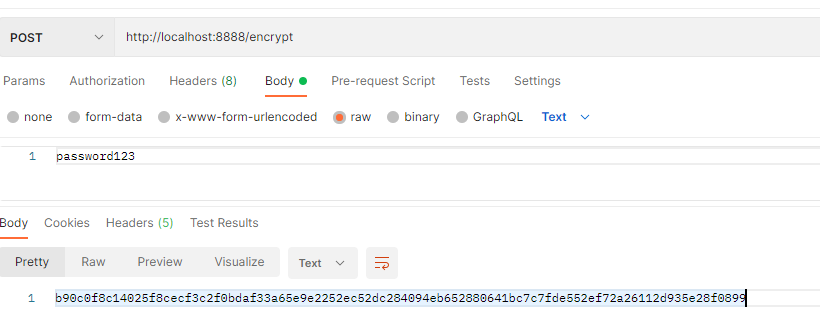

## Microservices with Spring Boot

### To generate a jar inside build folder

```
cd <springboot-project>
gradlew clean build
```

### To start a springboot project

Using java

```
java -jar build\libs\<spring-app-name.jar>
```

Using gradle 

```
gradlew bootRun
```

### To create a docker image

builds and pushes a container image for your application to a container registry

```
gradlew jib
```

To build to a Docker daemon, use:

```
gradle jibDockerBuild
```

create an image using Dockerfile
```
docker build . -t <docker-hub-username>/<image-name>:<version>
```

### Encryption and Decryption
http://<config-server>/encrypt


Note - add {cipher} prefix to differentiate between a plain text value and a encrypted value

http://<config-server>/decrypt

### Docker commands

| Command                              | Description                                                       |
|--------------------------------------|-------------------------------------------------------------------|
| docker pull <image_name>             | To pull a image                                                   |
| docker run -p 8090:8080 <image_name> | To start docker container                                         |
| docker ps -a                         | To view all containers, including those that are stopped.         |
| docker compose up                    | To create and start containers based on given docker compose file |
| docker compose down                  | To stop and remove containers                                     |
| docker compose start                 | To start containers based on given docker compose file            |
| docker compose stop                  | To stop the running containers                                    |

### Reference
Jib builds optimized Docker images for Java applications without a Docker daemon https://github.com/GoogleContainerTools/jib


